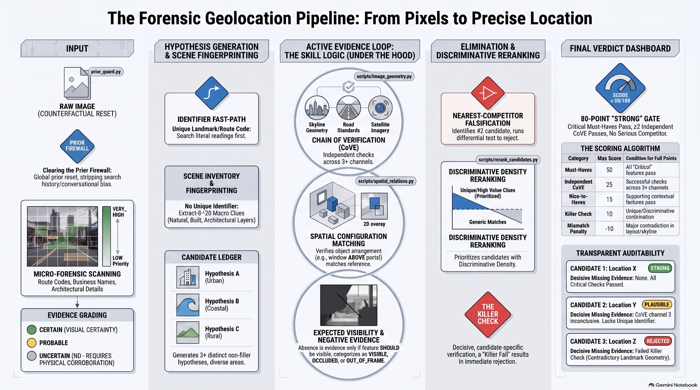

# Geo OSINT Locator

[](#install)

High-precision image geolocation skill for GeoGuessr-style analysis and GEO-OSINT verification from a **single image**.

It is designed around one principle:

> **Deduction, not prediction. Similarity is not identity.**

The skill does not jump to the first plausible place. It builds multiple hypotheses, verifies them through independent evidence channels, actively tries to falsify the leader, reranks the candidate set by discriminative evidence density, and only permits an exact-place answer after a strict `STRONG` gate.

<p align="center">
  
</p>

## What it does

Given one image, Geo OSINT Locator can:

- inspect small high-information regions before broad guessing;
- extract visual and textual identifiers without inventing unreadable text;
- build a scene fingerprint from architecture, terrain, roads, skyline, vegetation and spatial relations;
- reset geographic priors between images to prevent conversational anchoring;
- generate a candidate ledger with up to three meaningful hypotheses;
- run Chain-of-Verification (CoVE) across independent evidence channels;
- test expected visibility and negative evidence correctly;
- reconstruct coarse viewpoint geometry where useful;
- falsify the nearest serious competitor before promoting the leader;
- rerank candidates using **discriminative density**, not raw clue count alone;
- render a deterministic final SVG dashboard with the ranked candidate ledger.

## Core workflow

```text
Image
  ↓
Geographic Prior Firewall
  ↓
Micro-Forensics / Identifier Fast-Path
  ↓
Scene Fingerprinting
  ↓
Candidate Ledger
  ↓
Active Evidence Loop
  ├─ CoVE
  ├─ Spatial Configuration
  ├─ Expected Visibility
  ├─ Viewpoint Reconstruction
  └─ Runtime Map / Geometry Checks
  ↓
Nearest-Competitor Falsification
  ↓
Discriminative Reranking
  ↓
STRONG Gate
  ↓
Deterministic Final Dashboard
```

## Why this architecture

### Geographic prior firewall

Every new image starts from `GEOGRAPHIC_PRIOR = GLOBAL` unless the current image itself narrows the geography.

Previous guesses, prior test locations, recent successful regions and conversational recency contribute **zero geographic evidence**.

### Evidence before identity

The skill separates:

- visible observations;
- inferred interpretations;
- search hypotheses;
- verified candidate-specific matches.

A plausible resemblance is not enough to prove identity.

### Candidate competition

The top result is not promoted merely because it accumulates many compatible clues.

Before `STRONG`, the skill requires a serious competitor to be rejected, materially weaker, or absent after targeted search.

### Discriminative reranking

Raw clue count is not the final ordering key.

Evidence is weighted by:

```text
discrimination × quality × persistence
```

This prevents many generic clues from overpowering a smaller cluster of highly specific local clues.

### Exact-place lock

An exact location is authorized only when the full STRONG gate passes, including:

- score ≥ 80;
- all critical must-haves PASS;
- at least 2 independent CoVE channels PASS;
- a UNIQUE or DISCRIMINATIVE killer check PASS;
- no unresolved major mismatch;
- holistic scene match PASS when observable;
- viewpoint not INCOMPATIBLE when observable;
- nearest competitor rejected, materially weaker, or absent after targeted search.

Otherwise the skill returns a supported macro-area, `PLAUSIBLE`, `WEAK`, or `INDETERMINATE`.

## Candidate ledger

In ambiguous scenes, the skill generates at least three non-filler hypotheses when evidence permits it.

The final result preserves the top candidate ledger — including a candidate that later becomes `WEAK` or `REJECTED` — so a correct but under-ranked hypothesis remains auditable.

## Deterministic final dashboard

The final SVG layout is fixed by `scripts/dashboard_svg.py`.

Each candidate card contains:

1. rank + candidate / area;
2. status badge;
3. Confidence;
4. Score;
5. High/unique clues;
6. Holistic match;
7. Competitor;
8. Killer check;
9. Viewpoint.

Candidate `#1` is always visually highlighted.

The dashboard is a visualization of already-computed evidence; it is **not** an additional reasoning layer.

## Install

Install directly from GitHub with the open `skills` CLI:

```bash
npx skills add jumpifequal/geo-osint-locator-skill
```

Inspect what the CLI detects before installing:

```bash
npx skills add jumpifequal/geo-osint-locator-skill --list
```

Install globally for a specific agent:

```bash
npx skills add jumpifequal/geo-osint-locator-skill -g -a codex -y
npx skills add jumpifequal/geo-osint-locator-skill -g -a claude-code -y
```

Install from a local clone:

```bash
git clone https://github.com/jumpifequal/geo-osint-locator-skill.git
cd geo-osint-locator-skill
npx skills add .
```

Verify the repository before installation or contribution:

```bash
python -m pip install -r requirements-dev.txt
python tools/validate_repo.py
```

> `npx skills add` installs the skill. The repository itself does not require `npm install`; Node.js/npm are only needed to run the `skills` CLI.

## Quick start

### ChatGPT / Agent Skills

Install or expose the repository as a skill package with `SKILL.md` as the entry point.

Typical automatic triggers include:

```text
GeoGuess
Where was this photo taken?
Where is this?
What place is this?
Geolocate this image.
Dove è stata scattata questa foto?
Dove siamo?
Che posto è questo?
Geolocalizza questa immagine.
```

### Local helper scripts

The skill is model-driven, but deterministic helpers are included for operations that benefit from repeatability:

```bash
python scripts/image_geometry.py --help
python scripts/geo_math.py --help
python scripts/map_lookup.py --help
python scripts/overpass_lookup.py --help
python scripts/dashboard_svg.py --help
```

Install local development dependencies:

```bash
python -m pip install -r requirements-dev.txt
```

**NOTE**: You need this step ONLY if the skill is executed by a coding agent; if it's used in a web chat, the LLM handles installing the right modules.

## Helper modules

| Script | Purpose |
|---|---|
| `image_geometry.py` | Crop, zoom, tiling and deterministic image geometry |
| `geo_math.py` | Haversine distance, bearings and bounding boxes |
| `evidence_rank.py` | Rank next verification checks by expected elimination value |
| `spatial_relations.py` | Derive and compare coarse spatial relationships |
| `prior_guard.py` | Enforce candidate provenance and geographic-prior isolation |
| `competitor_gate.py` | Enforce STRONG-gate competitor and scene constraints |
| `rerank_candidates.py` | Rerank candidates by discriminative evidence density |
| `map_lookup.py` | Targeted Nominatim search/reverse lookup |
| `overpass_lookup.py` | Targeted Overpass queries |
| `dashboard_svg.py` | Render the deterministic final decision dashboard |

## Repository structure

```text
geo-osint-locator/
├── .github/
│   └── workflows/
│       └── validate.yml
├── agents/
│   └── openai.yaml
├── assets/
│   └── icon.svg
├── docs/
│   ├── assets/
│   │   └── forensic-geolocation-pipeline.png
│   ├── architecture.md
│   ├── examples.md
│   ├── output-contract.md
│   ├── runtime-tools.md
│   └── Zero_Hallucination_Geolocation_Architecture.pptx
├── references/
│   └── 01_... through 20_...
├── scripts/
│   └── deterministic helpers
├── CHANGELOG.md
├── CONTRIBUTING.md
├── SECURITY.md
├── SKILL.md
└── requirements-dev.txt
```

## Documentation

- [Architecture](docs/architecture.md)
- [Visual architecture](docs/visual-architecture.md)
- [Output contract](docs/output-contract.md)
- [Runtime tools](docs/runtime-tools.md)
- [Usage examples](docs/examples.md)

## Design constraints

The skill deliberately prefers:

- `INDETERMINATE` over a confident false positive;
- visible evidence over conversational priors;
- candidate-specific falsification over generic resemblance;
- independent evidence over duplicate observations;
- persistent structural clues over transient scene details;
- actual tool execution over narrated or implied execution.

## Development validation

The GitHub Actions workflow checks:

- required repository files;
- YAML frontmatter;
- agent UI metadata;
- Python syntax/imports;
- deterministic SVG dashboard rendering;
- core candidate reranking behavior;
- single-icon packaging.

Run the local equivalent with:

```bash
python tools/validate_repo.py
```

## Version

`1.0`

Author: **Enrico Frumento**

## License

No license is declared in the source skill. Add the license appropriate for your intended publication and redistribution policy before public release if required.
