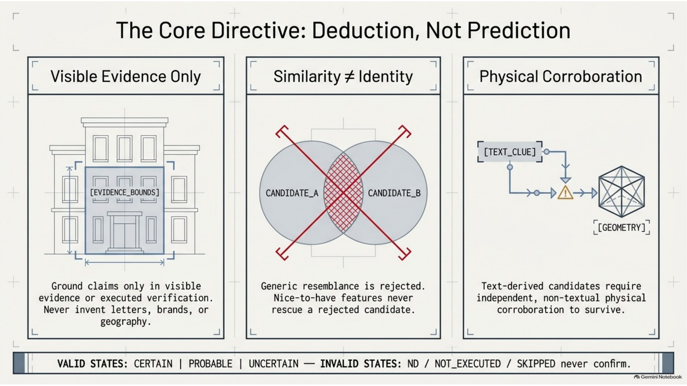
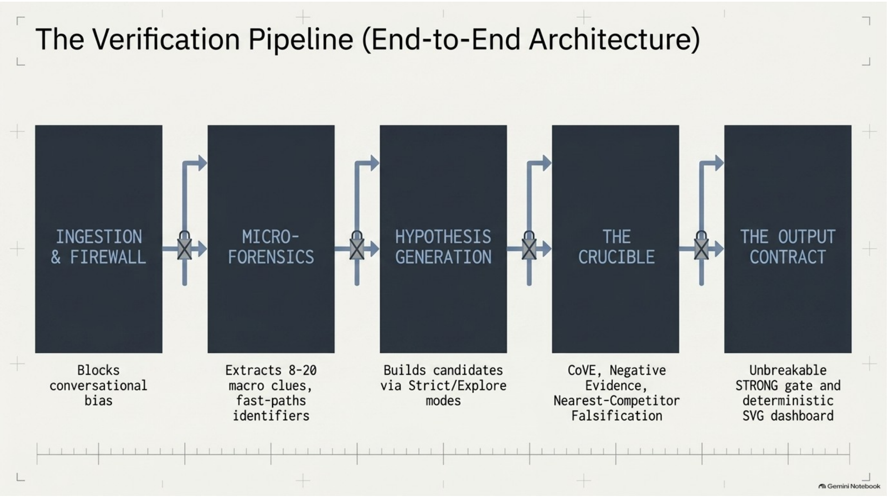
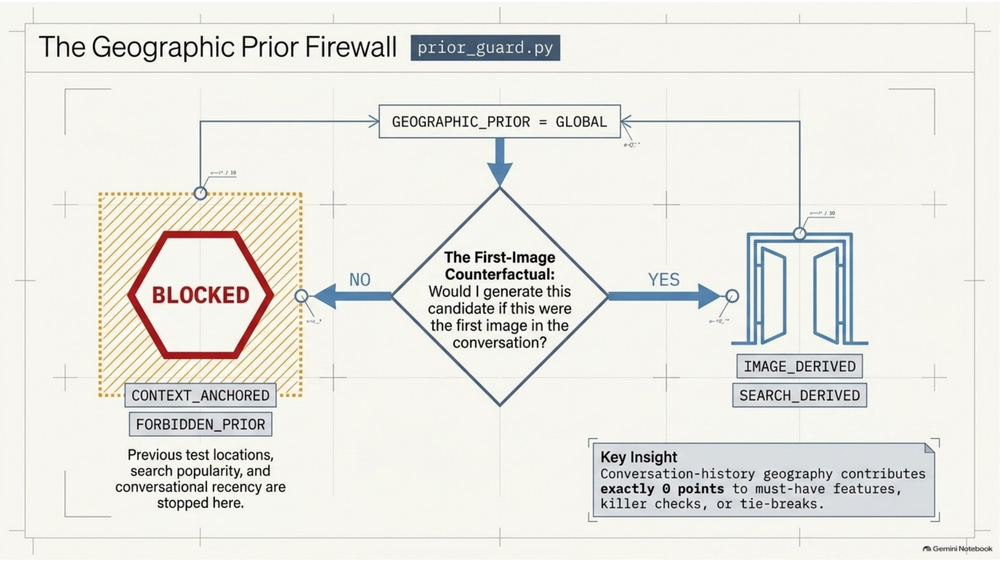
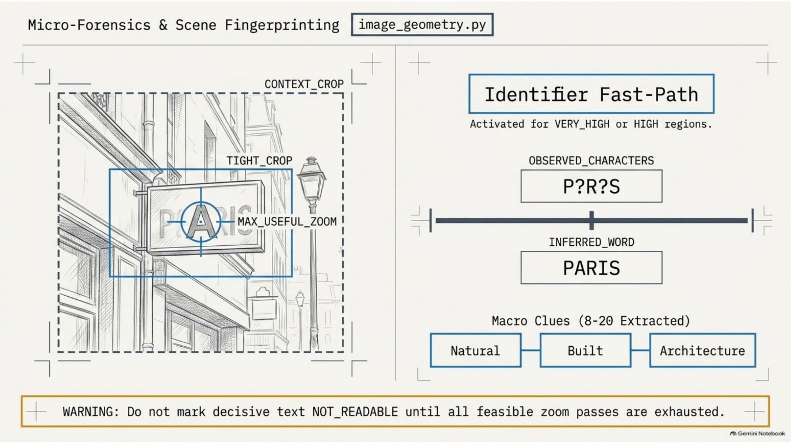
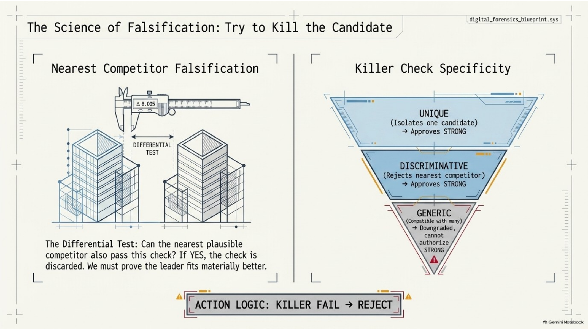
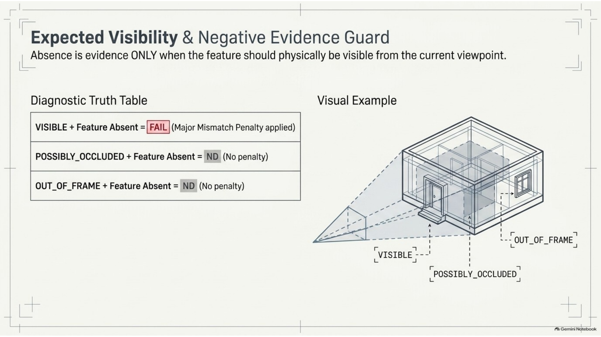
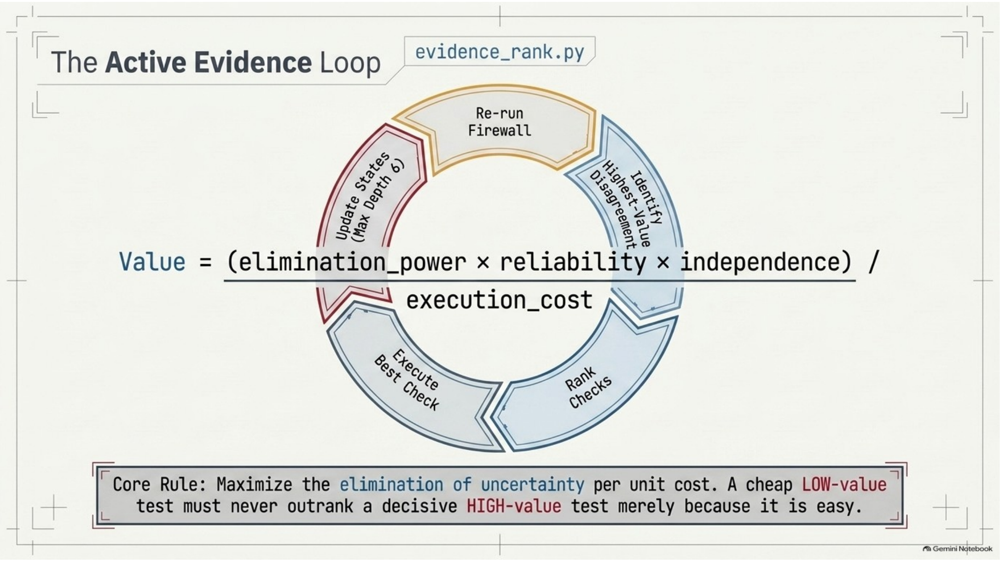
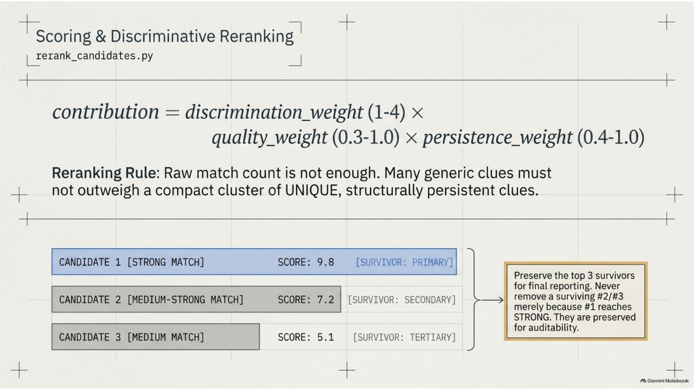
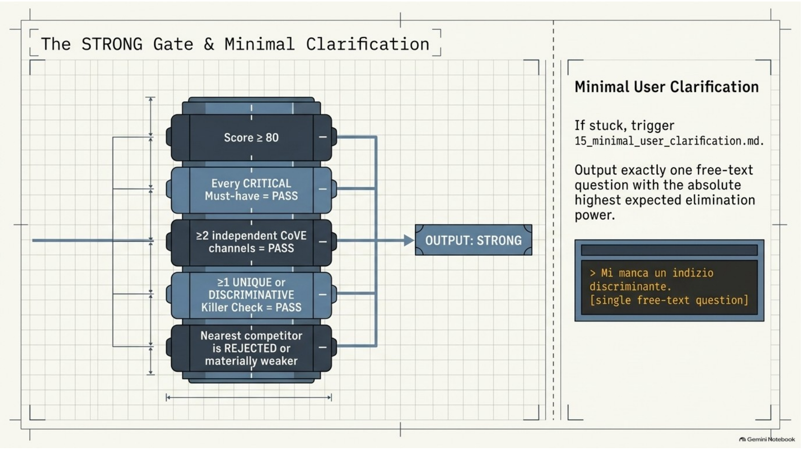
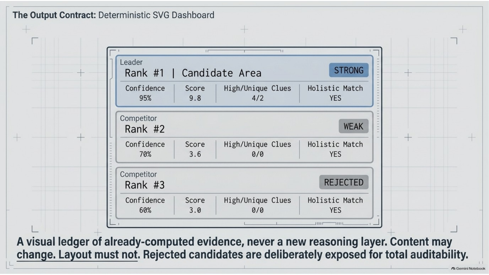

# Visual Architecture Index

This page exposes the main technical diagrams directly in the repository. The source presentation remains available as a deep-dive, but these images cover the core operational architecture without requiring PowerPoint.

## Core directive

## Verification pipeline

## Geographic prior firewall

## Micro-forensics

## Nearest-competitor falsification

## Expected visibility

## Active evidence loop

## Discriminative reranking

## STRONG gate

## Deterministic output dashboard

